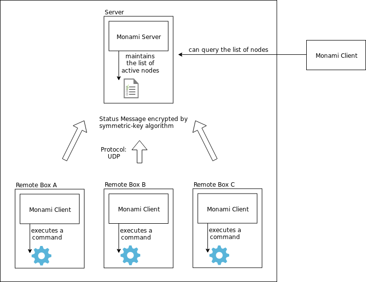

# monami
This is a simple monitoring tool for remote boxes, my friend

## Summary
To monitor remote boxes, a client program in a remote box periodically sends a status message to the server. And the server maintains a list of active nodes. We can set an expiration used for distinguising available nodes with unavailable ones.

Additionally, each status message can contain a tag and a command execution output. With using a tag, We can monitor various aspects of remote boxes separately.

## Architecture


- Monami-server accepts a status message from monami-client
- Each client has a [uuid](https://en.wikipedia.org/wiki/Universally_unique_identifier)
- Request and response messages are encrypted by AES-256-CBC cipher
- Messages are transferred via UDP datagram.

## Usage
```bash
$ ./monami server --help
monami-server
runs the monami server

USAGE:
    monami server [OPTIONS]

FLAGS:
    -h, --help       Prints help information
    -V, --version    Prints version information

OPTIONS:
        --expiratione <SECONDS>    Sets a expiration seconds [default: 30]
        --host <BIND_ADDRESS>      Sets a bind address [default: 127.0.0.1]
        --port <PORT_NUMBER>       Sets a port number to use [default: 12345]
        --secret <PASSPHRASE>      Sets a shared secret [default: minamo]
```

```bash
$ ./monami client --help
monami-client
runs the monami client

USAGE:
    monami client [OPTIONS] --command <SHELL_COMMAND> --tag <STRING>

FLAGS:
    -h, --help       Prints help information
    -V, --version    Prints version information

OPTIONS:
        --command <SHELL_COMMAND>    Sets a shell command to execute
        --host <SERVER_ADDRESS>      Sets a bind address [default: 127.0.0.1]
        --interval <SECONDS>         Sets the interval of sending a status update message [default: 10]
        --port <PORT_NUMBER>         Sets a port number to use [default: 12345]
        --secret <PASSPHRASE>        Sets a shared secret [default: minamo]
        --tag <STRING>               Sets a tag
```

```bash
$ ./monami control --help
monami-control
runs the monami controller

USAGE:
    monami control [OPTIONS] --function <STRING>

FLAGS:
    -h, --help       Prints help information
    -V, --version    Prints version information

OPTIONS:
        --function <STRING>           Sets a function name to execute
        --host <SERVER_ADDRESS>       Sets a bind address [default: 127.0.0.1]
        --parameters <JSON_STRING>    Sets parameters [default: {}]
        --port <PORT_NUMBER>          Sets a port number to use [default: 12345]
        --secret <PASSPHRASE>         Sets a shared secret [default: minamo]
```

## Note on portability
If preparing Rust build environment on remote boxes seems cumbersome, we can use `docs/monami-client.sh` instead of monami binary.
